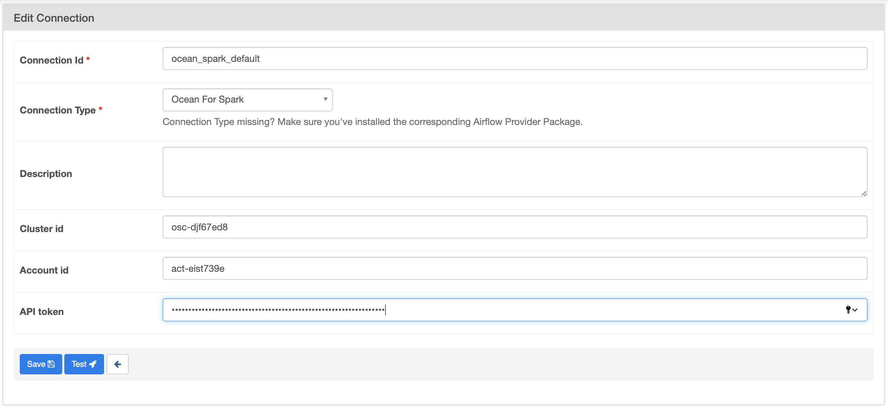

# Airflow connector to Ocean for Apache Spark

An Airflow plugin and provider to launch and monitor Spark
applications on [Ocean for
Apache Spark](https://spot.io/products/ocean-apache-spark/).

## Installation

```
pip install ocean-spark-airflow-provider
```

## Usage

For general usage of Ocean for Apache Spark, refer to the [official
documentation](https://docs.spot.io/ocean-spark/getting-started/?id=get-started-with-ocean-for-apache-spark).

### Setting up the connection

In the connection menu, register a new connection of type **Ocean for
Apache Spark**. The default connection name is `ocean_spark_default`. You will
need to have:

 - The Ocean Spark cluster ID of the cluster you just created (of the
   format `osc-e4089a00`). You can find it in the Spot console in the
   [list of
   clusters](https://docs.spot.io/ocean-spark/product-tour/manage-clusters),
   or by using the [Cluster
   List](https://docs.spot.io/api/#operation/OceanSparkClusterList) API.
 - [A Spot
   token](https://docs.spot.io/administration/api/create-api-token?id=create-an-api-token)
   to interact with the Spot API.



The **Ocean for Apache Spark** connection type is not available for Airflow
1, instead create an **HTTP** connection and fill your cluster id as
**host**, and your API token as **password**.

You will need to create a separate connection for each Ocean Spark
cluster that you want to use with Airflow.  In the
`OceanSparkOperator`, you can select which Ocean Spark connection to
use with the `connection_name` argument (defaults to
`ocean_spark_default`). For example, you may choose to have one
Ocean Spark cluster per environment (dev, staging, prod), and you
can easily target an environment by picking the correct Airflow connection.

### Using the Spark operator

```python
from ocean_spark.operators import OceanSparkOperator

# DAG creation

spark_pi_task = OceanSparkOperator(
    job_id="spark-pi",
    task_id="compute-pi",
    dag=dag,
    config_overrides={
        "type": "Scala",
        "sparkVersion": "3.2.0",
        "image": "gcr.io/datamechanics/spark:platform-3.2-latest",
        "imagePullPolicy": "IfNotPresent",
        "mainClass": "org.apache.spark.examples.SparkPi",
        "mainApplicationFile": "local:///opt/spark/examples/jars/examples.jar",
        "arguments": ["10000"],
        "driver": {
            "cores": 1,
            "spot": false
        },
        "executor": {
            "cores": 4,
            "instances": 1,
            "spot": true,
            "instanceSelector": "r5"
        },
    },
)
```

### Using the Spark Connect operator (available since airflow 2.6.2)

```python
from airflow import DAG, utils
from ocean_spark.operators import (
    OceanSparkConnectOperator,
)

args = {
    "owner": "airflow",
    "depends_on_past": False,
    "start_date": utils.dates.days_ago(0, second=1),
}


dag = DAG(dag_id="spark-connect-task", default_args=args, schedule_interval=None)

spark_pi_task = OceanSparkConnectOperator(
    task_id="spark-connect",
    dag=dag,
)
```

### Trigger the DAG with config, such as

```json
{
  "sql": "select random()"
}
```


more examples are available for [Airflow 2](./deploy/airflow2/dags).

## Test locally

You can test the plugin locally using the docker compose setup in this
repository. Run `make serve_airflow` at the root of the repository to
launch an instance of Airflow 2 with the provider already installed.
